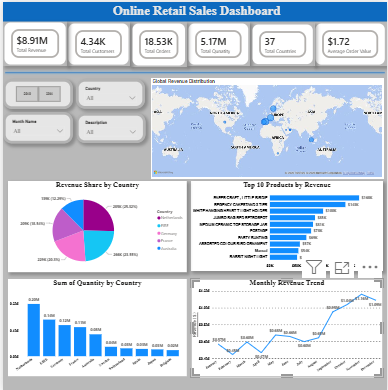

#  Online Retail Sales Dashboard (Power BI)

##  Overview

This project presents an interactive Power BI dashboard built using the Online Retail dataset. It provides insights into sales performance, customer behavior, product performance, and geographical distribution through interactive visualizations.

---

##  Business Objectives

- Analyze overall sales performance.
- Identify top-performing products.
- Compare revenue across countries.
- Track monthly revenue trends.
- Explore global sales distribution.

---

##  Tools & Technologies

- Power BI
- Power Query
- DAX
- Data Visualization

---

##  Dataset

The dataset contains:
- Invoice Number
- Product Description
- Quantity
- Unit Price
- Customer ID
- Country
- Invoice Date

---

##  Data Cleaning

- Removed records with Quantity ≤ 0
- Removed records with Unit Price ≤ 0
- Removed null Customer IDs
- Corrected data types
- Created calculated columns and DAX measures

---

##  Dashboard Features

### KPI Cards
- Total Revenue
- Total Customers
- Total Orders
- Total Quantity
- Total Countries
- Average Order Value

### Visualizations
-  Global Revenue Distribution (Map)
-  Revenue by Country
-  Revenue Share by Country
- Monthly Revenue Trend
- Top 10 Products by Revenue

---

## 💡 Key Insights

- The United Kingdom generated the highest revenue.
- November recorded the highest monthly sales.
- Paper Craft Little Birdie was the highest revenue-generating product.
- European countries contributed the majority of international sales.

---

## 📷 Dashboard Preview

---

## Skills Demonstrated

- Data Cleaning
- Data Transformation
- DAX Measures
- Dashboard Design
- Business Intelligence
- Data Visualization

  ## How to Open the Project

1. Download the `Online_Retail_Sales_Dashboard.pbix` file.
2. Open it using Microsoft Power BI Desktop.
3. Explore the dashboard using the slicers and filters.

> **Note:** Microsoft Power BI Desktop is required to open the `.pbix` file.
